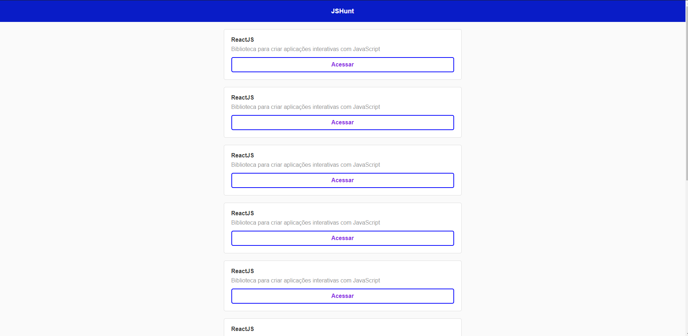

<h1 align="center">
    
</h1>

<h4 align="center"> 
	Huntweb 🚀
</h4>

## 💻 Sobre o projeto

🐱‍🏍 Huntweb

## 🛠 Tecnologias

As seguintes ferramentas foram usadas na construção do projeto:

- [Css][css]: posicionamento, dimensionamento e muito mais
- [Javascript][javascript]
- [HTML][html]: estrutura e efeitos
- [React][reactjs]: os fundamentos, como state, props, components, ciclo de vida.
- [Git][git]
- [Github][github]
- [Yarn][yarn]
- [Node.js][nodejs]

## 🚀 Como executar o projeto

Podemos considerar este projeto como sendo com uma parte:

1. Front End
2. API Rest

### Pré-requisitos

Antes de começar, você vai precisar ter instalado em sua máquina as seguintes ferramentas:
[Git](https://git-scm.com), [Node.js][nodejs].
Além disto é bom ter um editor para trabalhar com o código como [VSCode][vscode]

### 🧭 Rodando a aplicação web (Front End)

```bash
# Clone este repositório
$ git clone https://github.com/Igormazetti/huntweb.git

# Acesse a pasta do projeto no seu terminal/cmd
$ cd huntweb

# Instale as dependências
$ npm install

# Execute a aplicação em modo de desenvolvimento
$ npm run start

# A aplicação será aberta na porta:3000 - acesse http://localhost:3000

```

Feito por Igor Mazetti de Azevedo 👋🏽 [Entre em contato!](https://www.linkedin.com/in/igor-mazetti-de-azevedo-147679ba/)
